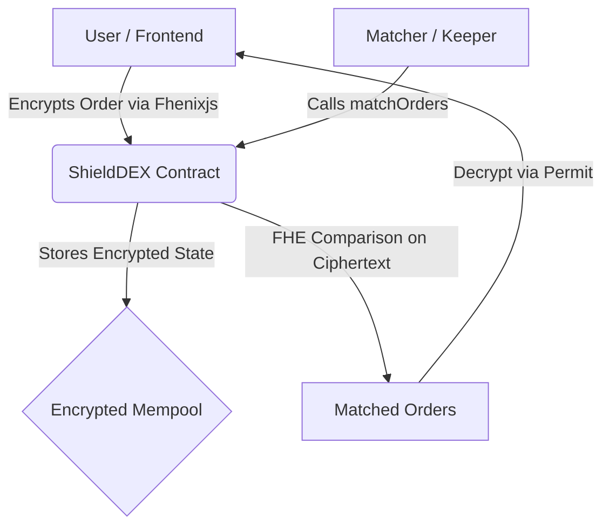

<div align="center">
  <h1>🛡️ ShieldDEX</h1>
  <p><strong>Match orders on ciphertext using Fully Homomorphic Encryption</strong></p>

  [](https://fhenix.io/)
  [](https://opensource.org/licenses/MIT)
  [](https://hardhat.org/)
  [](https://nextjs.org/)
  
  <br />

  <p>
    <a href="#-the-mev-problem">The MEV Problem</a> •
    <a href="#-core-features">Features</a> •
    <a href="#-getting-started">Getting Started</a> •
    <a href="#-architecture">Architecture</a>
  </p>
</div>

---

## 🎯 The MEV Problem

Public AMMs expose your slippage tolerance to the mempool, leading to billions lost to sandwich attacks and front-running. 

**ShieldDEX** solves this by encrypting your limit orders at the client side and processing the matching algorithm directly on the encrypted states. Secure your trades with mathematical pre-trade privacy and **absolute zero MEV**.

---

## ✨ Core Features

| Feature | How ShieldDEX Solves It |
| :--- | :--- |
| **Zero Front-running** | Searchers cannot read your trade size or limit price. Without parameters, profitable sandwich attacks are mathematically impossible. |
| **Mathematical Enforcement** | Instead of relying on trusted off-chain sequencers or flashbots, privacy is enforced mathematically on the Fhenix Layer 2. The contract never sees the plaintext. |
| **Permissionless Matching** | Anyone can trigger a match between two orders. The FHE comparison runs on ciphertext—even the matcher cannot extract price information from the operation. |
| **Selective Disclosure** | Only matched traders can decrypt their clearing price via a permit. Unmatched orders remain encrypted permanently. |

---

## 🚀 Getting Started

### Prerequisites

Ensure you have the following installed:
- [Node.js](https://nodejs.org/) (v18 or higher)
- [Hardhat](https://hardhat.org/)
- RPC access to the **Fhenix Network**

### 📦 Installation

Clone the repository and install the dependencies for both the contracts and the frontend:

```bash
# 1. Install contract dependencies
npm install

# 2. Compile FHE contracts
npm run compile
```

### ⚙️ Deployment

Deploy the smart contracts to the Fhenix Sepolia network:

```bash
# Deploys the mock FHERC20 tokens and the PrivateOrderBook
npm run deploy
```

> **Note**: The deployment script automatically updates `frontend/src/config/contract.ts` with the new contract addresses.

### 💻 Running the Frontend

Start the Next.js frontend application to interact with the DEX:

```bash
cd frontend
npm install
npm run dev
```

The application will be available at `http://localhost:3000`.

---

## 🏗️ Architecture



---

<div align="center">
  <h3>Stop bleeding value to searchers.</h3>
  <a href="http://localhost:3000"><strong>Launch ShieldDEX Locally</strong></a>
</div>
